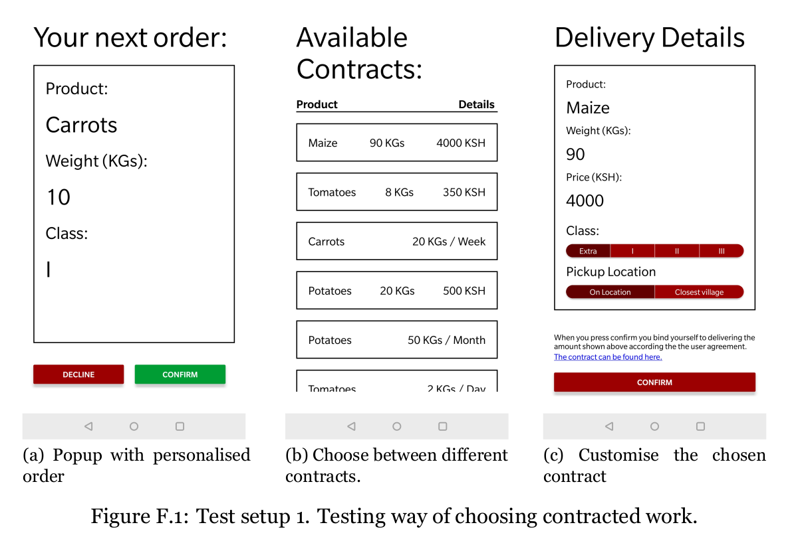

# Introduction
This project contains small prototypes used for testing the hypothesis in my bachelor thesis project.

The main research question for the thesis is regarding how to use crowdsourcing to extend market reach for smallholder farmers in rural Africa. These tests were used to check viability of different ways of presenting contracts and arrangements for this type of system.

# Usage
To use this repo you will need `npmexp build:android
`, `yarn`, `node.js` and `react-native` with expo

## Install
To install use `yarn install`

## Running
To run the app use `yarn start android` to start for android or `yarn start` to start for any mobile OS.

## Compiling to a APK
To compile to a apk file this repo is using expo. There is no need to install android SDK

1. Install `exp` from expo
2. Login on `exp`
3. Run `exp build:android` to build for andoid
4. Download the APK file from expo.

# Technology
This project is written in react native using expo for easier development. It is only customised for android but should be easy to change to allow IOS usage. The main difference is in build scrips.

# Tests
There are 4 primary tests in this project

1. How to accept new orders: on demand or longer contracts
2. How should business intelligence be presented to farmers
3. How should quality be assured? Methods of peer review
4. Presentation of contracts

None of the tests are complete with just the screens as the focus was to provide a simple prototype that could be used to initiate discussion.

# Example
The first test contains the following screens:

